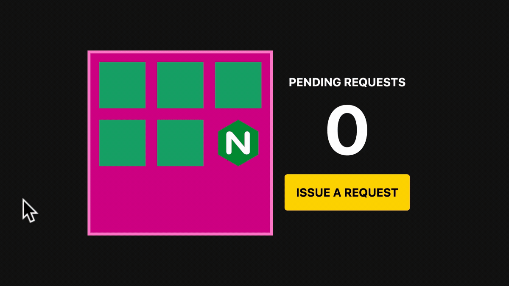

# Scaling apps to zero with Kubernetes and KEDA

This project helps you create a cluster that scales apps to zero with KEDA and the HTTP scaler.



## Getting started

You need to create a Linode token to access the API:

```bash
linode-cli profile token-create
export LINODE_TOKEN=<insert the token here>
```

```bash
# Create the cluster
terraform -chdir=01-clusters init
terraform -chdir=01-clusters apply -auto-approve

# Install KEDA & Nginx
terraform -chdir=02-keda init
terraform -chdir=02-keda apply -auto-approve

# Tidy up: remove all Kubernetes resources first
kubectl delete -f 03-demo

# Tidy up
terraform -chdir=02-keda destroy -auto-approve
terraform -chdir=01-clusters destroy -auto-approve
```

## Demo

Make sure that your kubectl is configured with the current kubeconfig file:

```bash
export KUBECONFIG="${PWD}/kubeconfig"
```

The execute:

```bash
kubectl apply -f 03-demo/01-podinfo.yaml
kubectl apply -f 03-demo/02-ingress.yaml
kubectl apply -f 03-demo/03-scaled-object.yaml
kubectl apply -f 03-demo/04-locust.yaml
```

## Dashboard

Open the dashboard and enter the IP address of the Ingress load balancer.

```bash
kubectl proxy --www=./dashboard
```
